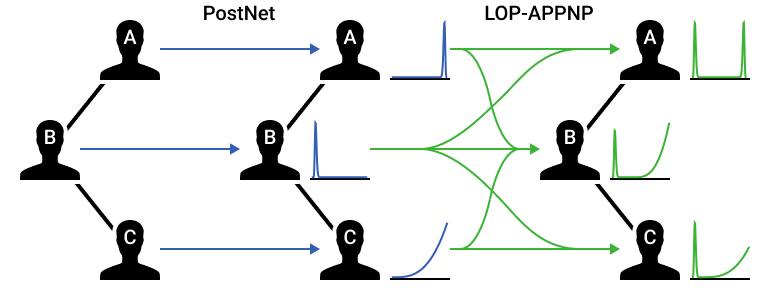

# LOP-GPN: Linear Opinion Pooling for Uncertainty Quantification on Graphs

<center></center>

This is the implementation of the *Linear Opinion Pooled Graph Posterior Network* (LOP-GPN) model, it is based on the official implementation of [Graph Posterior Networks](https://github.com/stadlmax/Graph-Posterior-Network) by Maximilian Stadler.

The following additions were made:
- Implementation of LOP-GPN
- Support for additional uncertainty measures
- Accuracy-rejection curve generation
- Added the `eval.clj` script for automatic evaluation and summarization of the experiments.
- Migrated the conda environment to Poetry.

## Installation

The installation requires [Poetry](https://python-poetry.org/).
All dependencies can then be installed in a virtual environment simply by running:
```sh
poetry install
```

The evaluation and result aggregation script (`eval.clj`) requires the [Babashka](https://babashka.org/) scripting runtime.

## Just run the experiments!

To replicate the results from the paper, you can simply run the following commands:
```sh
./eval.clj eval # Train and evaluate all model variants
./eval.clj acc-rej-tables # Aggregate the evaluation results into accuracy-rejection curves (CSV)
./eval.clj id-ood-table # Aggregate the OOD evaluation results into a table (CSV)
```
The individual trained model are written to `saved_experiments` and their evaluations are written to `results`.
All aggregated results are written as `*.csv` files to a `tables` directory.

Note that the implementation has only been tested on Linux; it might not run on MacOS or Windows.
